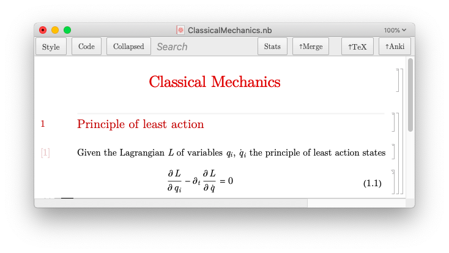
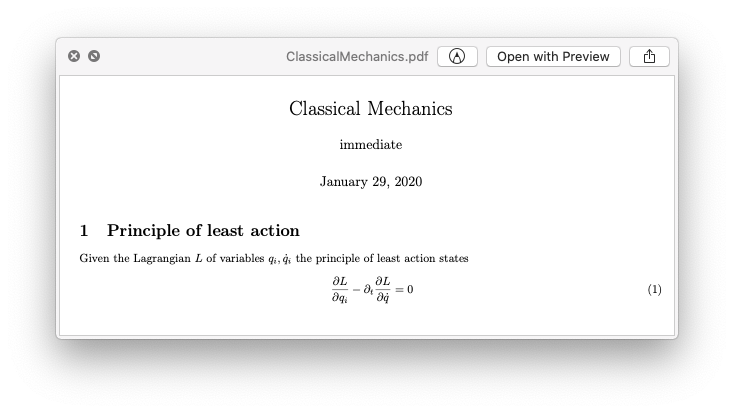
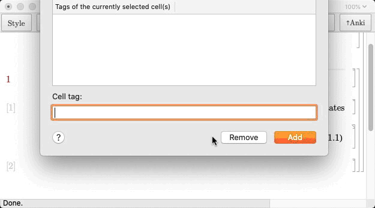
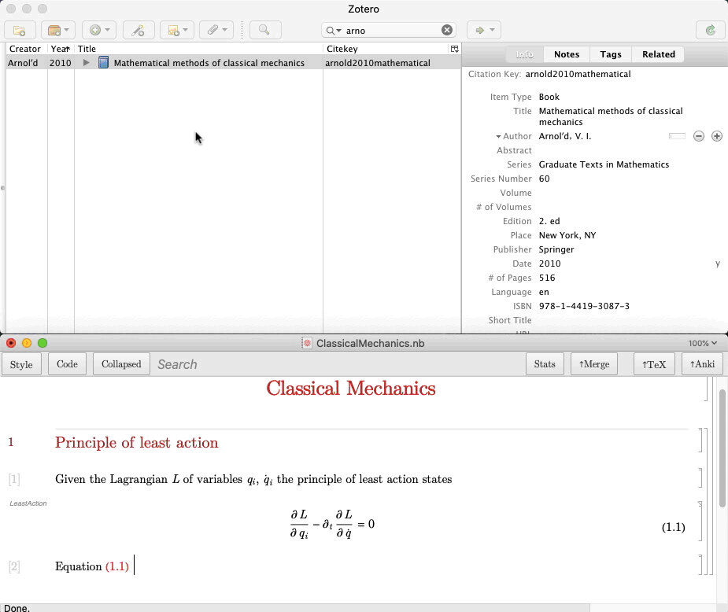
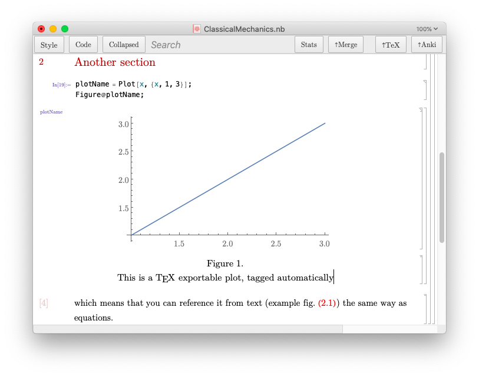

# ScienceNotebooks - beta (former Mathematica Anki 2.0)

> Warning this project is currently under overhaul.

> Note: Currently keyboard shortcuts work on Mac only.

> The project consists of Mathematica stylesheet and two subpackages:
>
> - TeXExport (for exporting TeX files from notebooks)
> - AnkiExport (for exporting Anki cloze cards from notebooks)

## Purpose

The aim of this project is to use the amazing capabilities of Mathematica to create universal notebooks which can be used not only for calculations, but also for:

- collecting knowledge in decently styled notebooks (through Science stylesheet)
- reviewing structured knowledge (through integrated AnkiExporter)
- fast-drafting scientific papers (through integrated TeXExporter)

The side effects of this project are that your knowledge collected in Anki is no longer 'loose'. It belongs to the notebook and is identified by them (through CellID), hence can be continuously updated by updating the notebook.
Moreover, each Anki card acquires context from the location in the notebook and each deck acquires context from the notebook location under the root (`Knowledge`) directory.
On the other hand, thanks to Zotero integration the notebooks are linked with references ("fixing" the citation problem in Mathematica on Mac).

<!--  -->

## Prerequisites

1. [Mathematica](https://www.wolfram.com/mathematica/)
2. [Anki](http://ankisrs.net)
3. [AnkiConnect (anki plugin)](https://ankiweb.net/shared/info/2055492159)
4. [Zotero](https://www.zotero.org)

## Installation and usage

Some of the steps can be omitted, but will result in minor issues/ decrease in functionality. The most essential steps enumerated. However consider doing all the steps to go 'all-in'.

- General
  - Install `Latin Modern` fonts from the `Resources` folder on your system for the best experience.
  1. Download the [latest paclet](https://github.com/masteranza/ScienceNotebooks/releases)
  2. Run `PacletInstall@"path/to/paclet"` in Mathematica.
  3. Open Mathematica `SetOptions[$FrontEnd, CreateCellID -> True]`. Make sure you don't forget about this step - otherwise we won't be able to identify Anki notes with Mathematica cells.\*\*
  4. Create a root `Knowledge` folder with `mkdir ~/Dropbox/Knowledge`.
     (You could make it anywhere, but would need to change the path in the paclet, sorry):
  - Run `CurrentValue[$FrontEnd, "DefaultStyleDefinitions"] = "Science.nb";` this will not only set the default stylesheet, but also ensures that figures exported with the built in TeX Exporter will work properly.
  - In Mathematica, Preferences -> Messages set Kernel Messages to `Print to Console` it make notebooks more tidy by printing errors and logs to a seperate notebook.
- Zotero
  - Put the `zotselect-mathematica.js` file in [Zotero translators directory](https://www.zotero.org/support/zotero_data#locating_your_zotero_library) and set `Export -> Default Format` to `ZotSelect Mathematica`.
- Anki
  - Import Anki cloze note type `Anki/MathematicaCloze.apkg` to Anki.

<!-- It's a special cloze note type which looks like this:
 -->

<!-- - In Mathematica, Preferences -> System uncheck `Create and maintain version specific front end preferences` -->
   <!-- and either set Notebook Security to `Always trust` or add the `Knowledge` folder to Trusted Directories. -->

- (Optional) Run the command: `SetOptions[$FrontEnd, InputAliases -> Join[InputAliases /. Options[$FrontEnd, InputAliases], {"at" -> TemplateBox[{"\[SelectionPlaceholder]", "Automatic", "\[Placeholder]", "\[Placeholder]"}, "EvaluatedAt", DisplayFunction -> (SubsuperscriptBox[ RowBox[{#1, StyleBox["\[VerticalLine]", SpanMinSize -> 1.5, SpanSymmetric -> False]}], RowBox[{"\[MediumSpace]", #3}], RowBox[{"\[MediumSpace]", #4}]] &)]}]]` once. To add the notion of "values at limit" in formatted cells

## Test ride

> In what follows you'll see an example employing the core capabilities.

1. We start of with manually creating an example directory structure under `Knowledge` folder and an empty notebook.

2. Like usual, type in your
   - Title cell <kbd>CMD</kbd>+<kbd>1</kbd>
   - Section cell <kbd>CMD</kbd>+<kbd>2</kbd>
   - Text cell <kbd>CMD</kbd>+<kbd>7</kbd> with a styled inline cells <kbd>CTRL</kbd>+<kbd>9</kbd>
   - EquationNumbered cell <kbd>CMD</kbd>+<kbd>6</kbd>

3. At this level of complexity the notebook can be compiled (through `TeXExporter`) to pdf directly. Press `TeX` button from the toolbar and choose `Quick PDF`. For more control go to `More on TeXExporter`.

3. Add a tag to equation with <kbd>CMD</kbd>+<kbd>J</kbd> and reference it in text by writing the name of the tag and pressing <kbd>CTRL</kbd>+<kbd>E</kbd>.

4. Copy a Zotero reference with <kbd>CMD</kbd>+<kbd>SHIFT</kbd>+<kbd>C</kbd> and insert it by pressing <kbd>CTRL</kbd>+<kbd>Z</kbd>

5. To generate a TeX file (or PDF) with bib references you need to save the `.bib` file from Zotero (preferably with Better BibTeX) next to the notebook and use the explicit export command `ExportToTeX[TeXBibFile -> "BibFileName"]` then open the `.tex` file and compile the project. Now you can do this faster (and have control over all the options) by pressing TeX -> Custom from the toolbar. This will insert the full expression in the beginning of your notebook.

6. As a final example export something to Anki. This is done by marking the cell content with a keyboard shortcut <kbd>CMD</kbd>+<kbd>D</kbd> and pressing the `Anki` button while the Anki app is open. After the export is done you can start reviewing your material.

> Here we use a fancy cell style (you can use a regular text cell as well) by pressing <kbd>CMD</kbd>+<kbd>4</kbd> and <kbd>TAB</kbd> repeatedly.

> Anki highlights will be ignored when exporting to TeX.

> The commands for Anki highlighting, Zotero referencing and referencing equations (also any other content!) are available in the Mathematica `Insert` menu.

> The [complete notebook](Example/ClassicalMechanics.nb) together with exported example [.tex file](Example/ClassicalMechanics.tex) and [.pdf file](Example/ClassicalMechanics.pdf) can be found in `Example` folder.

### Figures in notebooks

Drafting TeX documents often involves captioned figures.
You can create them very quickly by using the `Figure` function.
Which will automatically use the variable name as CellTag for referencing the equation.

If you'd run `Figure@Plot[x, {x, 1, 3}];` directly, Mathematica would invent a two word tag for you, like "DistalHemps", which you can also use for referencing.

> Figures get automatically updated without destroying the caption. Even if the figure (and the caption) are away from the `Figure` function that generates it.

## More on TeXExporter

Example command to control the TeX export:

    ExportToTeX[TeXExportToPDF -> False,
    TeXEmbedRefrencesBeforeExport -> False,
    TeXWriteTOC -> False,
    TeXBibFile -> "BibFileName",
    TeXWriteAuthors -> False,
    TeXWriteDate -> False,
    TeXWriteTitle -> False,
    TeXCustomCommands -> "\\setlength\\parindent{0pt}",
    TeXLanguage -> None,
    TeXShowLabels -> False,
    TeXSetMargin -> "0.7in",
    TeXLineSpread -> "1.15",
    TeXFitEquations -> True]

> Here the `"BibFileName"` is the name of the `BibFileName.bib` file which ought to be located in the same directory.

Try inserting `Author` and `Affiliation` cells under the title, and export using `ExportToTeX[TeXWriteAuthors -> True]`

## Styles supported by AnkiExporter and TeXExporter

Not all cells get exported to Anki currently supported include:

- Text
- EquationNumbered
- Equation
- Figure
- Item1, Item2, Item3
- Item1Numbered, Item2Numbered, Item3Numbered
- Example, Exercise, Solution
- Question, Remark, Comment, FunFact
- Theorem, Proof, Axiom, Definition, Lemma

## Troubleshooting and notes

Highlighting shortcut appears not to work when caps-lock is enabled.
Someone might think that <kbd>CMD</kbd>+<kbd>SHIFT</kbd>+<kbd>D</kbd> will do the job and try to press it... and then BANG! You've just learned that it doesn't work, but instead splits the selected text into another cell - useful. Serendipity.

## Acknowledgements

> The project relies heavily on the stuff found on http://mathematica.stackexchange.com/
> hence, I don't own the credit for many of the functions which I merely customized.
>
> Special thanks to @KubaPod for all the help along the way!
